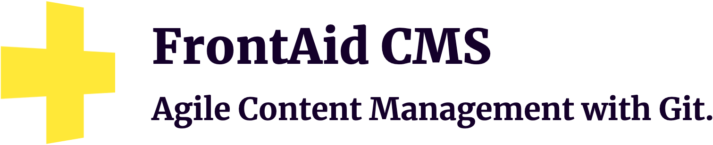

# Awesome CSS Frameworks 

List of awesome CSS frameworks.  
Feel free to [contribute](https://github.com/troxler/awesome-css-frameworks/blob/master/.github/CONTRIBUTING.md).

**Supported by [FrontAid CMS](https://frontaid.io/?pk_campaign=cssfw)**:

## Contents
- [Base / Reset / Normalize](#base--reset--normalize)
- [Class-less](#class-less)
- [Very Lightweight](#very-lightweight)
- [General Purpose](#general-purpose)
- [Material Design](#material-design)
- [Utility-based](#utility-based)
- [Specialized](#specialized)
- [Stalled Development](#stalled-development)

## Base / Reset / Normalize

- [**modern-normalize**](https://github.com/sindresorhus/modern-normalize) - Normalize browsers' default style.  
  
  [Repo](https://github.com/sindresorhus/modern-normalize)
  | #CSS

- [**ress**](https://github.com/filipelinhares/ress) - Modern CSS reset.  
  
  [Repo](https://github.com/filipelinhares/ress)
  | #CSS

- [**Natural Selection**](https://github.com/frontaid/natural-selection) - Collection of best-practice CSS selectors.  
  
  | #CSS

## Class-less

Frameworks that use semantic HTML and do not rely on classes.

- [**MVP.css**](https://andybrewer.github.io/mvp/) - Minimalist stylesheet for HTML elements.  
  
  [Docs](https://andybrewer.github.io/mvp/#docs),
  [Repo](https://github.com/andybrewer/mvp/)
  | #CSS

- [**sakura**](https://oxal.org/projects/sakura/) - Minimal classless CSS framework/theme.  
  
  [Demo](https://oxal.org/projects/sakura/demo/),
  [Repo](https://github.com/oxalorg/sakura)
  | #SCSS

- [**Simple.css**](https://simplecss.org/) - Lightweight, classless CSS framework.  
  
  [Demo](https://simplecss.org/demo),
  [Docs](https://github.com/kevquirk/simple.css/wiki),
  [Repo](https://github.com/kevquirk/simple.css/)
  | #CSS

- [**Tacit**](https://yegor256.github.io/tacit/) - CSS framework for dummies, without classes.  
  
  [Repo](https://github.com/yegor256/tacit/)
  | #SCSS

## Very Lightweight

Frameworks that are smaller than ~5KB.

- [**Pure**](https://purecss.io) - Set of small, responsive CSS modules that you can use in every web project.  
  
  [Demo](https://purecss.io/layouts/),
  [Docs](https://purecss.io/start/),
  [Repo](https://github.com/pure-css/pure)
  | #CSS

- [**Picnic CSS**](https://picnicss.com) - Lightweight and beautiful library.  
  
  [Demo](https://picnicss.com/tests),
  [Docs](https://picnicss.com/documentation),
  [Repo](https://github.com/franciscop/picnic)
  | #SCSS

- [**Chota**](https://jenil.github.io/chota/) - Really small CSS framework.  
  
  [Demo](https://raw.githack.com/jenil/chota/master/test/index.html),
  [Docs](https://jenil.github.io/chota/#docs),
  [Repo](https://github.com/jenil/chota)
  | #CSS

## General Purpose

- [**Bootstrap**](https://getbootstrap.com) - The most popular HTML, CSS, and JavaScript framework for developing responsive, mobile first projects on the web.  
  
  [Demo](https://getbootstrap.com/docs/4.0/examples/),
  [Docs](https://getbootstrap.com/docs/4.0/),
  [Repo](https://github.com/twbs/bootstrap)
  | #SCSS

- [**Bulma**](https://bulma.io) - Modern CSS framework based on Flexbox.  
  
  [Demo](https://bulma.io/expo/),
  [Docs](https://bulma.io/documentation/overview/start/),
  [Repo](https://github.com/jgthms/bulma)
  | #Sass

- [**Foundation**](https://get.foundation/) - The most advanced responsive front-end framework in the world.  
  
  [Demo](https://get.foundation/templates.html),
  [Docs](https://get.foundation/sites/docs/),
  [Repo](https://github.com/foundation/foundation-sites)
  | #SCSS

- [**UIkit**](https://getuikit.com) - Lightweight and modular front-end framework for developing fast and powerful web interfaces.  
  
  [Demo](https://getuikit.com/v2/showcase/index.html),
  [Docs](https://getuikit.com/docs/introduction),
  [Repo](https://github.com/uikit/uikit)
  | #LESS #SCSS

- [**Primer**](https://primer.style/) - CSS framework that powers GitHub's front-end design.  
  
  [Docs](https://primer.style/css/),
  [Repo](https://github.com/primer/css)
  | #SCSS

- [**Pico.css**](https://picocss.com/) - Elegant styles for all native HTML elements, dark mode automatically enabled.  
  
  [Demo](https://picocss.com/#examples),
  [Docs](https://picocss.com/docs/),
  [Repo](https://github.com/picocss/pico)
  | #SCSS

- [**Carbon Components**](https://www.carbondesignsystem.com/) - Component library behind IBM's Carbon Design System.  
  
  [Docs](https://www.carbondesignsystem.com/components/overview/),
  [Repo](https://github.com/carbon-design-system/carbon)
  | #SCSS

- [**U.S. Web Design System**](https://designsystem.digital.gov/) - Components used by U.S. federal government websites.  
  
  [Docs](https://designsystem.digital.gov/components/overview/),
  [Repo](https://github.com/uswds/uswds)
  | #SCSS

- [**Fomantic-UI**](https://fomantic-ui.com/) - Build beautiful websites fast, with concise HTML, intuitive javascript, and simplified debugging.  
  
  [Docs](https://fomantic-ui.com/introduction/getting-started.html),
  [Repo](https://github.com/fomantic/fomantic-ui/)
  | #LESS

- [**Blaze UI**](https://www.blazeui.com) - Open source modular toolkit providing great structure for building websites quickly with a scalable and maintainable foundation.  
  
  [Demo](https://www.blazeui.com/components/buttons/),
  [Docs](https://www.blazeui.com/getting-started/install/),
  [Repo](https://github.com/BlazeSoftware/atoms)
  | #SCSS

- [**Cirrus**](https://cirrus-ui.netlify.app/) - Component and utility centric SCSS framework designed for rapid prototyping.  
  
  [Demo](https://cirrus-ui.netlify.app/getting-started/examples),
  [Docs](https://cirrus-ui.netlify.app/getting-started/setup),
  [Repo](https://github.com/Spiderpig86/Cirrus)
  | #CSS

- [**Vanilla Framework**](https://vanillaframework.io/) - Simple, extensible CSS framework. Written by the Canonical Web Team.  
  
  [Demo](https://vanillaframework.io/docs/examples),
  [Docs](https://vanillaframework.io/docs/),
  [Repo](https://github.com/canonical/vanilla-framework)
  | #SCSS

- [**PatternFly**](https://www.patternfly.org/) - UI framework for enterprise web applications.  
  
  [Demo](https://www.patternfly.org/patterns/about-patterns),
  [Docs](https://www.patternfly.org/get-started/),
  [Repo](https://github.com/patternfly/patternfly)
  | #SCSS #LESS

- [**Stacks**](https://stackoverflow.design/) - UI components used by Stack Overflow.  
  
  [Docs](https://stackoverflow.design/product/develop/using-stacks/),
  [Repo](https://github.com/StackExchange/Stacks)
  | #LESS

- [**HiQ**](https://jonathanharrell.github.io/hiq/) - Simple CSS foundation with responsive typography and input styling.  
  
  [Docs](https://jonathanharrell.github.io/hiq/guide/),
  [Repo](https://github.com/jonathanharrell/hiq/)
  | #PostCSS

## Material Design

- [**Material Components Web**](https://material.io/components/web/) - Modular and customizable Material Design UI components for the web.  
  
  [Demo](https://material.io/components?platform=web),
  [Docs](https://material.io/develop/web/getting-started),
  [Repo](https://github.com/material-components/material-components-web)
  | #SCSS

- [**Beer CSS**](https://www.beercss.com) - Build material design interfaces in record time without stress for devs.  
  
  [Repo](https://github.com/beercss/beercss)
  | #CSS

- [**Materialize**](https://materializecss.github.io/materialize/) - Responsive front-end library based on Google's Material Design.  
  
  [Docs](https://materializecss.github.io/materialize/getting-started.html),
  [Repo](https://github.com/materializecss/materialize)
  | #SCSS

## Utility-based

- [**Tailwind CSS**](https://tailwindcss.com) - Utility-first CSS framework for rapid UI development.  
  
  [Docs](https://tailwindcss.com/docs),
  [Repo](https://github.com/tailwindlabs/tailwindcss)
  | #CSS

- [**Open Props**](https://open-props.style) - CSS custom properties to help accelerate adaptive and consistent design.  
  
  [Demo](https://open-props.style/#gallery),
  [Docs](https://open-props.style/#getting-started),
  [Repo](https://github.com/argyleink/open-props/)
  | #CSS #PostCSS

## Specialized

- [**NES.css**](https://nostalgic-css.github.io/NES.css/) - NES-style CSS Framework.  
  
  [Demo](https://nostalgic-css.github.io/NES.css/),
  [Docs](https://github.com/nostalgic-css/NES.css#installation),
  [Repo](https://github.com/nostalgic-css/NES.css)
  | #SCSS

- [**98.css**](https://jdan.github.io/98.css/) - CSS library for building interfaces that look like Windows 98.  
  
  [Repo](https://github.com/jdan/98.css)
  | #CSS

- [**Tufte CSS**](https://edwardtufte.github.io/tufte-css/) - Style your webpage like Edward Tufte’s handouts.  
  
  [Repo](https://github.com/edwardtufte/tufte-css)
  | #CSS

- [**Gutenberg**](https://github.com/BafS/Gutenberg) - Modern framework to print the web correctly.  
  
  [Demo](https://bafs.github.io/Gutenberg/),
  [Docs](https://github.com/BafS/Gutenberg#what-does-the-framework-do-)
  | #SCSS

- [**System.css**](https://sakofchit.github.io/system.css/) - Design system for building retro Apple interfaces.  
  
  [Repo](https://github.com/sakofchit/system.css)
  | #PostCSS

- [**XP.css**](https://botoxparty.github.io/XP.css/) - CSS library for building interfaces that look like Windows XP.  
  
  [Repo](https://github.com/botoxparty/XP.css)
  | #PostCSS

- [**TuiCss**](https://github.com/vinibiavatti1/TuiCss) - Library to create MS-DOS interfaces.  
  
  [Demo](https://github.com/vinibiavatti1/TuiCss/wiki/Examples),
  [Docs](https://github.com/vinibiavatti1/TuiCss/wiki)
  | #SCSS

- [**7.css**](https://khang-nd.github.io/7.css/) - CSS library for building interfaces that look like Windows 7.  
  
  [Repo](https://github.com/khang-nd/7.css)
  | #PostCSS

- [**Bojler**](https://bojler.slicejack.com) - Email framework for developing responsive and lightweight email templates.  
  
  [Docs](https://bojler.slicejack.com/documentation/getting-started/),
  [Repo](https://github.com/Slicejack/bojler)
  | #SCSS

- [**Orbit**](https://zumerlab.github.io/orbit-docs/) - CSS framework designed for building any kind of radial UI.  
  
  [Docs](https://zumerlab.github.io/orbit-docs/introduction/),
  [Repo](https://github.com/zumerlab/orbit)
  | #SCSS

## Stalled Development

Frameworks that have not seen any real development for more than about one year or officially have been deprecated.
We are keeping them here for reference/inspiration and hope for a revival.

  
<strong>Show Section</strong>

- [**Semantic UI**](https://semantic-ui.com) - User interface is the language of the web.  
  
  [Docs](https://semantic-ui.com/introduction/getting-started.html),
  [Repo](https://github.com/semantic-org/semantic-ui)
  | #LESS

- [**Tachyons**](https://tachyons.io) - Quickly build and design new UI without writing CSS.  
  
  [Demo](https://tachyons.io/gallery/),
  [Docs](https://tachyons.io/docs/),
  [Repo](https://github.com/tachyons-css/tachyons/)
  | #CSS

- [**Bourbon**](https://www.bourbon.io/) - Lightweight Sass tool set.  
  
  [Docs](https://www.bourbon.io/docs/latest/),
  [Repo](https://github.com/thoughtbot/bourbon/)
  | #SCSS

- [**Water.css**](https://watercss.kognise.dev/) - Just-add-CSS collection of styles to make simple websites just a little nicer.  
  
  [Repo](https://github.com/kognise/water.css)
  | #CSS

- [**sanitize.css**](https://csstools.github.io/sanitize.css/) - The best-practices CSS foundation.  
  
  [Repo](https://github.com/csstools/sanitize.css)
  | #CSS
  
- [**modern-css-reset**](https://github.com/hankchizljaw/modern-css-reset) - Tiny little reset that you can use as the basis of your CSS projects.  
  
  [Repo](https://github.com/hankchizljaw/modern-css-reset)
  | #CSS

- [**minireset.css**](https://jgthms.com/minireset.css/) - Tiny modern CSS reset.  
  
  [Repo](https://github.com/jgthms/minireset.css)
  | #Sass

- [**CSS Remedy**](https://github.com/jensimmons/cssremedy) - Start your project with a remedy for the technical debt of CSS.  
  
  | #CSS

- [**inuitcss**](https://github.com/inuitcss/inuitcss) - Extensible, scalable, Sass-based, OOCSS framework for large and long-lasting UI projects.  
  
  [Repo](https://github.com/inuitcss/inuitcss)
  | #SCSS

- [**unsemantic**](https://unsemantic.com) - Fluid grid for mobile, tablet, and desktop.  
  
  [Demo](https://unsemantic.com/demo-responsive),
  [Docs](https://unsemantic.com/css-documentation),
  [Repo](https://github.com/nathansmith/unsemantic)

- [**Propeller**](https://propeller.in) - Front-end responsive framework based on Google's Material Design standards & Bootstrap.  
  
  [Docs](https://propeller.in/frameworks/open-source/get-started/),
  [Repo](https://github.com/digicorp/propeller)
  | #SCSS

- [**Concise CSS**](https://concisecss.com) - Give up the bloat. Stop tripping over your classes. Be concise.  
  
  [Docs](https://concisecss.com/documentation/),
  [Repo](https://github.com/ConciseCSS/concise.css)
  | #SCSS

- [**Responsive Boilerplate**](https://responsivebp.com) - Powerful, accessible, developer friendly framework for building responsive websites.  
  
  [Docs](https://responsivebp.com/getting-started/),
  [Repo](https://github.com/responsivebp/responsive)
  | #SCSS

- [**turretcss**](https://turretcss.com) - Responsive front-end framework for accessible and semantic websites.  
  
  [Demo](https://turretcss.com/demo/),
  [Docs](https://turretcss.com/getting-started/),
  [Repo](https://github.com/turretcss/turretcss)
  | #CSS

- [**Centurion**](https://www.centurionframework.com) - Web-based framework for rapid prototyping and building larger web projects.  
  
  [Docs](https://github.com/justinhough/Centurion/blob/master/DOCUMENTATION.md),
  [Repo](https://github.com/justinhough/Centurion)

---

## License
License [CC0 1.0](https://creativecommons.org/publicdomain/zero/1.0/):

> You can copy, modify, distribute and perform the work, even for commercial purposes, all without asking permission.

Images of GitHub stars are provided by [Shields](https://github.com/badges/shields).
